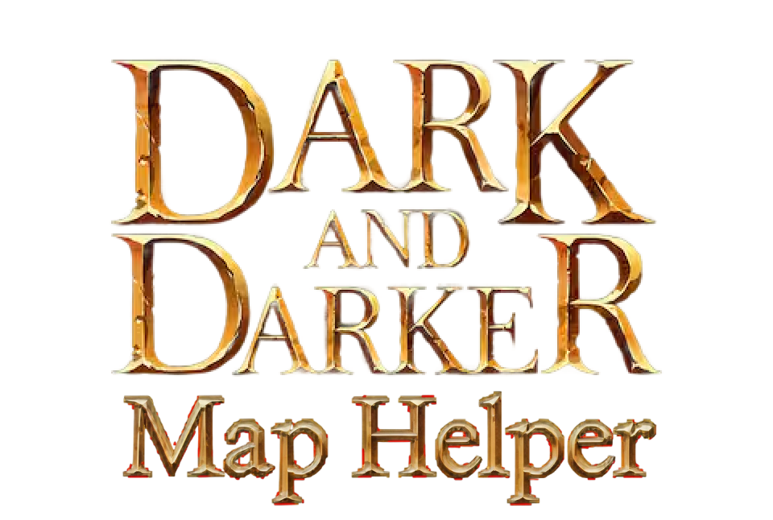
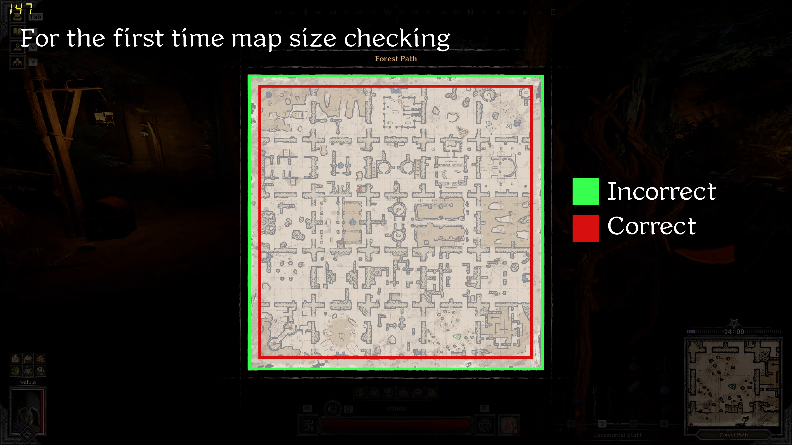

<div align="center">



</div>

A real-time map overlay tool for Dark and Darker that uses computer vision to automatically detect which map you're on and display location names with a grid overlay.

## Features

- **Auto-Detection**: Automatically identifies the current map using ORB feature matching on the first visible cell
- **Real-Time Updates**: Progressive cell detection with live overlay updates
- **Multi-Language Support**: Location names in English, Chinese, and more (easily extensible)
- **Smart Caching**: Remembers your map selection for 15 minutes (configurable)
- **ROI Selection**: One-time region selection for the map area on your screen
- **Performance Optimized**: Multithreaded detection with configurable parameters
- **Custom Fonts**: Support for custom font loading (place .ttf/.otf files in `fonts/` directory)

## Supported Maps

- Crypt
- Goblin Cave
- Ice Abyss
- Ice Cave
- Inferno
- Ruins

## Installation

### Option 1: Download Pre-built Executable (Recommended)

1. Go to [Releases](https://github.com/garyku0/dnd-maphelper/releases)
2. Download the latest `MapHelper-vX.X.X-Windows.zip`
3. Extract to a folder
4. Run `MapHelper.exe`

**✨ Truly Standalone:**
- Single .exe file (~100MB) with all maps and fonts embedded
- No Python installation required
- No external folders needed (except config files you create)
- Just download and run!

### Option 2: Run from Source

**Prerequisites:**
- Python 3.7 or higher
- Windows (tested), Linux/Mac (may require adjustments)

**Setup:**

1. Clone the repository:
```bash
git clone https://github.com/garyku0/dnd-maphelper.git
cd dnd-maphelper
```

2. Install dependencies:
```bash
pip install -r requirements.txt
```

3. Run the application:
```bash
python main.py
```

## Usage

### First Time Setup

1. **Run the application** - A transparent overlay will appear
2. **Press M** to toggle the map overlay
3. **Select ROI** - On first run, drag to select the map area on your screen

   

   *Drag to select the map area (shown in red). The green border is incorrect exmaple*

4. **Choose Detection Method**:
   - **Auto-Detect**  - Automatically identifies the map (Slower)
   - **Manual Selection** - Choose from available maps
   - **Settings** - Configure detection parameters

### Controls

| Key | Action |
|-----|--------|
| `M` | Toggle map overlay on/off |
| `R` | Reset cache and force re-detection |
| `ESC` x2 | Exit application (press ESC twice within 1 second) |

### Map Detection Workflow

1. Press `M` to activate
2. Application captures the map area (ROI)
3. Auto-detection analyzes the first cell only (fast!)
4. Confirms the detected map with you
5. Performs full detection on all cells (background)
6. Displays grid overlay with location names
7. Results cached for 15 minutes

## Configuration

### Settings (settings.json)

Customize detection parameters via the in-app settings menu or by editing `settings.json`:

```json
{
  "threading_enabled": true,
  "thread_count": 8,
  "min_inliers": 6,
  "match_threshold": 10,
  "cache_duration_minutes": 15,
  "update_interval_cells": 3,
  "orb_features": 6000,
  "ratio_test": 0.75,
  "early_stop_threshold": 75,
  "min_cache_confidence": 60,
  "language": "en"
}
```

**Key Settings:**
- `language`: Display language for location names (`"en"`, `"zh"`, etc.)
- `cache_duration_minutes`: How long to remember the current map
- `threading_enabled`: Enable/disable multithreading (try `false` if detection is slow)
- `thread_count`: Number of parallel threads for detection (8-10 recommended)
- `orb_features`: Number of ORB features to extract (higher = more accurate but slower)
- `update_interval_cells`: Update overlay every N cells during detection
- `early_stop_threshold`: Confidence % (0-100) to stop checking other rotations (higher = more thorough)
- `min_cache_confidence`: Minimum confidence % to trust cached cell results (prevents bad matches from sticking)

**Threading Notes:**
- ORB feature matching is CPU-intensive. Due to Python's GIL, threading may not always improve speed
- Try `"threading_enabled": false` if multithreading feels slower
- Single-threaded can be faster on some systems, especially with small grids (5x5)

### ROI (Region of Interest)

The ROI is saved per screen resolution in `config.json`. To reset:
- Press `R` to reset cache, or
- Delete `config.json` and restart

## Adding New Maps

1. Create a folder in `maps/` with your map name (e.g., `maps/NewMap/`)
2. Add cell templates as images:
   - `1_0.png`, `1_90.png`, `1_180.png`, `1_270.png` (cell 1, all rotations)
   - Continue for all cells
3. (Optional) Create `grid_config.txt`:
   ```
   5,5
   ```
   (rows, columns)
4. (Optional) Add translations in `locations_XX.json`:
   ```json
   {
     "cell_name": "Display Name"
   }
   ```

See `maps/TRANSLATION_GUIDE.md` for details on adding translations.

## Project Structure

```
maphelper/
├── main.py                  # Entry point
├── matcher.py               # Core matching logic
├── requirements.txt         # Dependencies
├── settings.json            # User settings
├── config.json             # ROI configurations
│
├── ui/                     # UI Components
│   ├── overlay_manager.py  # Overlay display
│   └── dialogs.py          # Menus and dialogs
│
├── core/                   # Core Logic
│   └── detection.py        # Real-time detection
│
├── utils/                  # Utilities
│   ├── config.py          # Config management
│   ├── capture.py         # Screen capture
│   └── settings.py        # Settings manager
│
├── maps/                   # Map templates
│   ├── Crypt/
│   ├── GoblinCave/
│   ├── IceAbyss/
│   ├── IceCave/
│   ├── Inferno/
│   └── Ruins/
│
├── fonts/                  # Custom fonts (optional)
│   └── [your-font].ttf
│
└── tools/                  # Utility scripts
    └── optimize_templates.py
```

## Tuning Detection Thresholds

The app logs confidence scores to `confidence_log.txt` during detection. Use this data to optimize settings:

```bash
python analyze_confidence.py
```

This shows:
- Min/Max/Average confidence scores
- Percentile distribution
- Recommendations for optimal thresholds based on your actual data

**Example output:**
```
RECOMMENDATIONS:
  Suggested Settings (based on your data):
    "early_stop_threshold": 68  // P75 - stop when match is in top 25%
    "min_cache_confidence": 52  // P25 - re-match if below bottom 25%
```

If confidence values are consistently lower than defaults (75/60), the thresholds are too high and should be adjusted.

## Troubleshooting

### Map Not Detected
- Ensure the ROI correctly captures the map area
- Try increasing `orb_features` in settings
- Check that lighting/brightness is consistent with templates
- Use manual selection if auto-detect fails
- **Run `python analyze_confidence.py` to check if thresholds are too high**

### Overlay Not Showing
- Verify the overlay window appears (check taskbar)
- Press `M` to toggle visibility
- Ensure ROI is properly set

### Performance Issues
- Reduce `thread_count` in settings
- Decrease `orb_features` for faster detection
- Increase `update_interval_cells` for less frequent updates

## Technical Details

### Detection Algorithm

1. **Template Matching**: Uses ORB (Oriented FAST and Rotated BRIEF) feature detection
2. **Feature Extraction**: 6000 features per template (configurable)
3. **Matching**: FLANN-based matcher with ratio test (0.75)
4. **Validation**: Homography with RANSAC, minimum 6 inliers
5. **Rotation Handling**: Tests 0°, 90°, 180°, 270° rotations
6. **Optimization**: Early stopping when confidence exceeds threshold

### Performance

- **First Cell Detection**: <1 second (fast auto-detect)
- **Full Map Detection**: 2-5 seconds (background, progressive updates)
- **Multi-threading**: Parallel cell matching for speed
- **Caching**: Results cached for 15 minutes to avoid re-detection

## Contributing

We welcome contributions! There are several ways to help:

### 🗺️ Add New Maps

Help expand map coverage by contributing templates for new maps. See [CONTRIBUTING.md](CONTRIBUTING.md) for detailed instructions.

### 🌍 Improve Translations

**We need help with translations!** Current location names are basic/automatic and need improvement.

To contribute translations (just change your game language and record the names!):

1. Find translation files in `maps/[MapName]/names.json`
2. Add or improve translations for your language:
   ```json
   {
     "en": {"CellName": "English Name"},
     "zh": {"CellName": "中文名称"},
     "es": {"CellName": "Nombre en Español"}
   }
   ```
3. Submit a pull request

**Supported languages:**
- English (`en`)
- Chinese (`zh`)
- Spanish (`es`)
- And more! (Use ISO 639-1 codes)

See `maps/TRANSLATION_GUIDE.md` for more details.

### 🐛 Report Bugs or 💡 Suggest Features

Open an issue on GitHub with your bug report or feature suggestion.

### 👨‍💻 For Developers

See [CONTRIBUTING.md](CONTRIBUTING.md) for:
- Development setup
- Building executables
- Code guidelines
- Pull request process

## License

MIT License - See LICENSE file for details

## Acknowledgments

- Built for the Dark and Darker community
- Uses OpenCV for computer vision
- ORB feature detection for robust matching

## Support

For issues or questions:
- Open an issue on GitHub
- Check existing issues for solutions
- Review the troubleshooting section above
